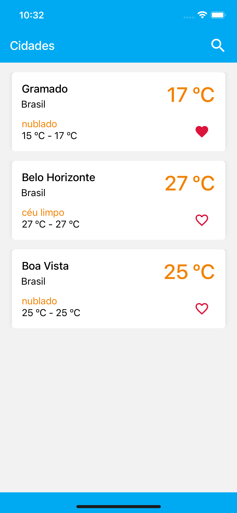
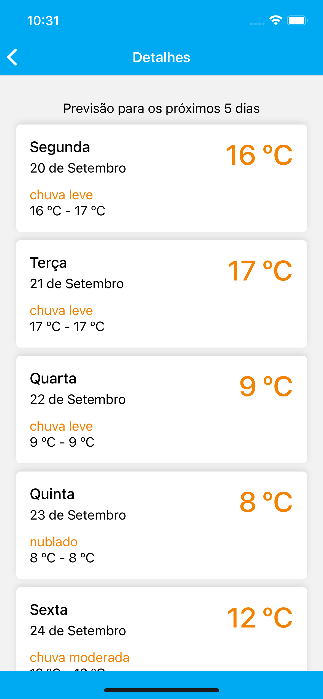
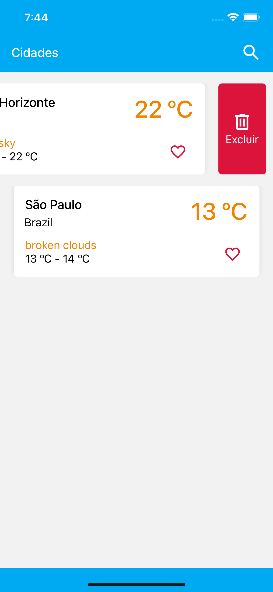
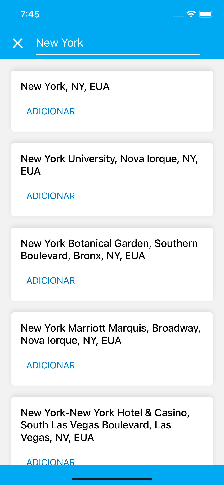

# Weather App

This project was created with React-Native in the challenge of company SpartaLabs.

# Screen

<table>
  <tr>
    <td>
      
    </td>
    <td>
      
    </td>
  <tr>
    <tr>
    <td>
      
    </td>
    <td>
      
    </td>
  <tr>
</table>

## How to run the project?

- Step One

  ```shell
    $ git clone https://github.com/KassioVieira/WeatherApp.git
  ```

- Step Two
  ```shell
   $ cd WeatherApp && yarn
  ```
- Step Three
  ```shell
   $ cd ios && pod install
  ```
- Step Four

  - Change the file name `.env.example` to `.env` and add your credentials.

- Step Five

  ```shell
  $ yarn ios
  ```

  or

  ```shell
    $ yarn android
  ```

# About this project

implemented support multiple languages

- pt_BR
- en_US

`application language depends on device language setting`

Celsius will be used as a measure of temperature when device language it is Portuguese and Fahrenheit when it is English
